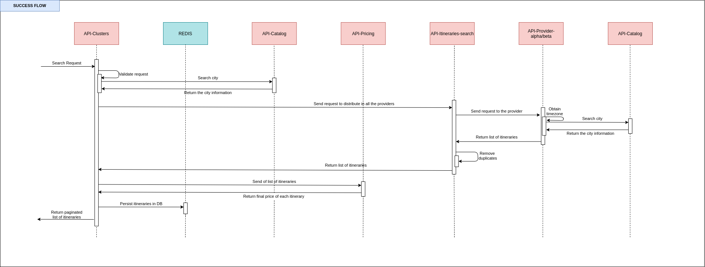

# Manning TWA - Optimizing Cost

 

This project contains all the code related to the live series of “Optimize costs in Microservices”.

## Table of contents

The following are the most important topics in this file:
- [Requirements](#Requirements)
- [Architecture](#Architecture)
  - [Microservices](#Microservices)
  - [Model](#Model)
  - [Flow](#Flow)
  - [Technologies](#Technologies)
- [Run the APIs](#run-the-apis)
- [Documentation of APIs](#documentation-of-apis)
- [Considerations](#Considerations)

## Requirements

To use these microservices you need to have in your machine the following things:
- [Java 11](https://www.oracle.com/ar/java/technologies/javase-jdk11-downloads.html)
- [Maven](https://maven.apache.org/)
- [Git](https://git-scm.com/)
- [Docker](https://www.docker.com/)

## Architecture

The microservices are an abstraction of all the flow of the flight’s team. These microservices only contain all endpoints related to searching. 

#### Microservices

The system comprises the following microservices:
* **api-catalog** is a microservice containing all information about which are the valid cities to find flights. This API only returns a certain amount of flights that are required in the request, to get the next page of results without doing a new search, all the results will save it in a database with a TTL. 
* **api-clusters** is a microservice containing all the validations about the parameters of the search. Also, call **api-pricing** to get the final price of each itinerary.
* **api-pricing** is a microservice containing all the rules to add a markup of each itinerary and calculate the final price of each of them.
* **api-itineraries-search** is a microservice containing all logic, of which providers need to call to get all the itineraries. Also, this microservice removes duplicates.
* **api-provider-alpha** is a microservice that simulates to get the information of an external provider.
* **api-provider-beta** is a microservice that simulates to get the information of an external provider.

The following picture illustrates the architecture described above.

#### Model

Most of the microservices use a common model of classes to prevent duplicate code in each of them exists a library [Flights Common DTO](https://github.com/andres-sacco/manning-twa-libs-dto).

The common model comprises the following group of classes/enums:
* **AvailabilityRequestDTO** - This class contains all the parameters uses to search.
* **Provider** - This enum contains all the providers (Alpha, Beta).
* **FlightType** - This enum contain all the flights types(One-way, Return). 
* **PassengerType** - This enum contain all the passengers types.
* **ItineraryDTO** & **SegmentDTO**  & **LegDTO** - These classes have all the common information about one group of flights. Also contain a reference to the price.
* **PriceInfoDTO** - This class contains all the information about the price of all the types of passengers.
* **PaxPriceDTO** - This class refers to the price of one type of passenger.
* **MarkupDTO** - This class has all the information about the markup of one itinerary. 

#### Flow

The flow of each request to search has the following steps:
1. API-Clusters receive a request and validate common information like the number of passengers and the distribution of them, the departure date, and some other information.
2. API-Clusters do a request of each city to validate the existence of that city.
3. API-Clusters do a request with all the information related to the search to API-Itineraries-search. 
4. API-Itineraries-search find all the providers and do a request with the same information that they receive it.
5. Each provider gets all the itineraries that match the conditions of the request. Also, each provider does several requests to get the timezone of each city and with this information calculate the duration of each flight.
6. API-Clusters send all the itineraries to API-Pricing to get all the information about the markup of each flight and which is the final price.
7. API-Clusters save the entire responses for a brief period in the Redis database because the search is paginated, so API-Clusters use the database to prevent do the same search again just to get the next page the result.

The following picture illustrates the flow described above.

Also, you can see the flow with more detail in this picture:

#### Technologies

The microservices use some frameworks/libraries:
- **spring-boot** is a common framework to develop a Java application easily because most of the things have a simple configuration.
- **springdoc-openapi** is an implementation of the standard of Open API 3.
- **chaos-monkey-spring-boot** is a library that simulate random problems in the microservices following the principles of **Chaos Engineering** like latency, exceptions.
- **orika** is a library that helps to map the values from one object to another.
- **snakeyaml** is a library to use YML files as resources.

## Run the APIs

To run API, please follow these steps:
- Clone the repository using this command **git clone https://github.com/andres-sacco/manning-twa-api.git**
- Open a terminal in the directory of the API and run **mvn clean install** this command compiles all the code and generates the jars. After doing that, run **docker-compose build** and  **docker-compose up** all the components run together.
- If everything works fine, open a web browser in the URL which appears in the documentation section.

Another option is to open each project in the IDE (Eclipse, IntelliJ) and run it. Take into consideration that the repository has a file **docker-compose-infrastructure.yml** which has the containers to run the databases that **Catalog** and **Pricing** uses to get the information, so compile and run this file before running all the microservices in your IDE.

## Documentation of APIs

Each API has documentation to understand which parameters are required and the URL to invoke them. To see the API documentation is necessary to run each project and access to:
- [Swagger - Clusters](http://localhost:4070/api/flights/clusters/documentation)
- [Swagger - Pricing](http://localhost:5070/api/flights/pricing/documentation)
- [Swagger - Catalog](http://localhost:6070/api/flights/catalog/documentation)
- [Swagger - Itineraries Search](http://localhost:7070/api/flights/itineraries-search/documentation)
- [Swagger - Provider Alpha](http://localhost:8070/api/flights/provider/alpha/documentation)
- [Swagger - Provider Beta](http://localhost:9070/api/flights/provider/beta/documentation)

**Note:** Take into consideration that all the API has to GET methods except API-Pricing because this API needs to receive a list of Itineraries, so it’s not possible to use a GET method. 

Optionally you can use [**Postman**](https://www.postman.com/) or [**Insomia**](https://insomnia.rest/) to do the request from the different microservices, the repository includes a collection of each tool with all the endpoints.

## Considerations

To run all the microservices in the same machine, you need to consider that the following ports need to be available to use it:
| Name                    | Application   | Database    |
| -----------             | -----------   | ----------- |
| api-clusters            | 4070          | 6079        |
| api-pricing             | 5070          | 3010        |
| api-catalog             | 6070          | 3011        |
| api-itineraries-search  | 7070          | ---         |
| api-provider-alpha      | 8070          | ---         |
| api-provider-beta       | 9070          | ---         |

Take into consideration that the port of the databases is only necessary when you run all the microservices in your IDE and use **docker-compose-infrastructure.yml** to run the databases. If you run all microservices using **docker-compose.yml**, you only check the ports of the **Application** column.
