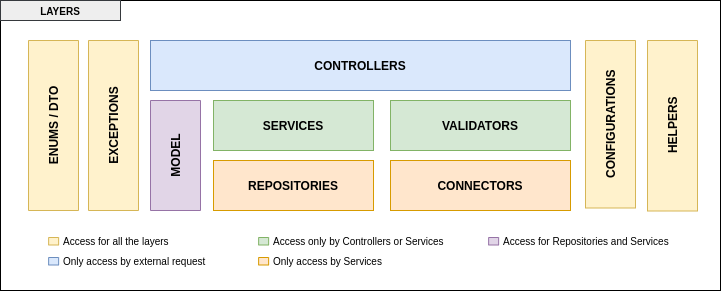
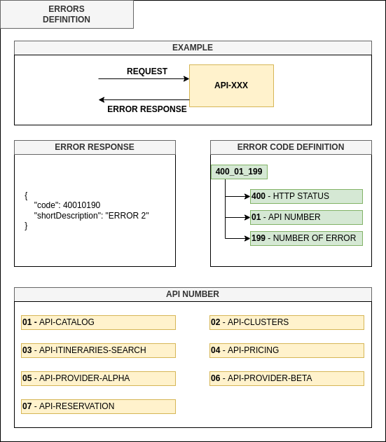

# Manning TWA - Moving to Kotlin Microservices

This project contains all the code related to “Moving to Kotlin Microservices” live series.  The idea is to show a realistic scenario that the readers could understand and solve the problems that appear in the live series, for that reason you have all the code of the other microservices but is not necessary check or modify the other projects. You can just run the docker-compose file and add the new code.

## Table of contents

The following are the most important topics in this file:
- [Requirements](#Requirements)
- [Architecture](#Architecture)
  - [Microservices](#Microservices)
  - [Layers](#Layers)
  - [Model](#Model)
  - [Flow](#Flow)
    - [Searching](#Searching)
    - [Booking](#Booking)
  - [Technologies](#Technologies)
  - [Errors definition](#errors-definition)
  - [Internal libraries](#internal-libraries)
- [Run the APIs](#run-the-apis)
- [Documentation of APIs](#documentation-of-apis)
- [Considerations](#Considerations)

## Requirements

To use these microservices you need to have in your machine the following things:
- [Java 11](https://www.oracle.com/ar/java/technologies/javase-jdk11-downloads.html)
- [Maven](https://maven.apache.org/)
- [Git](https://git-scm.com/)
- [Docker](https://www.docker.com/)

If you don't have some of these tools in your machine installed, please follow the instructions in the official documentation of each tool.

## Architecture

The microservices are an abstraction of all the flow of the flight’s team reducing the scope to the search and book operations. Take into consideration that depending of which live project you are doing you will have or not the **api-reservation**.

#### Microservices

The system comprises the following microservices:
* **api-catalog** is a microservice containing all information about which are the valid cities to find flights. This API only returns a certain amount of flights that are required in the request, to get the next page of results without doing a new search, all the results will save it in a database with a TTL.
* **api-clusters** is a microservice containing all the validations about the parameters of the search. Also, call **api-pricing** to get the final price of each itinerary.
* **api-pricing** is a microservice containing all the rules to add a markup of each itinerary and calculate the final price of each of them.
* **api-itineraries-search** is a microservice containing all logic, of which providers need to call to get all the itineraries. Also, this microservice removes duplicates.
* **api-provider-alpha** is a microservice that simulates to get the information of an external provider.
* **api-provider-beta** is a microservice that simulates to get the information of an external provider.
* **api-reservation** is a microservice save the information about a book of a particular itinerary.

The following picture illustrates the architecture described above.

### Layers

All the microservices are split in different layers which only have access to others layers. The following figure show you the common structure in all the microservices:

Now, a little about what contain each layer:

| Layer                      | Description                                                                                                             | Packages                                              | Example                           |
|----------------------------|-------------------------------------------------------------------------------------------------------------------------|-------------------------------------------------------|-----------------------------------|
| Controllers                | Contain all the endpoints of the microservices                                                                          | *.controller                                          | UserController                    |
| Resources                  | Contain all documentation about the microservices like definition of the endpoints and Swagger                          | *.controller.documentation                            | UserResources                     |
| Request/Response           | In this layer you can find the Data Transfer Object (DTO) that are using across the different layers                    | *.dto.request, *.dto.response                         | UserRequest, UserResponse         |
| Services                   | Contain all the definition of the services and the implementation                                                       | *.service and *.service.impl                          | IUserService, UserService         |
| Validators                 | Contain all the logic to validate a Request of a DTO                                                                    | *.validator                                           | UserValidator                     |
| Repositories               | This layer contain the definition using interfaces and in some cases contain the specification to do a particular query | *.repository, *.repository.impl, and *.specification  | UserRepository, UserSpecification |
| Connectors                 | Inside this layer there are all the communications to external microservices or system.                                 | *.connector                                           | UserConnector                     |
| Connector Configuration    | Inside this layer there are all the configurations related with connectors to external services.                        | *.connector.configuration                             | UserConnectorConfiguration        |
| Helpers                    | All the classes that help in different things in the entire microservices                                               | *.helper                                              | UserHelper                        |
| Configuration              | All the logic to configure different aspects of the microservices (e.g format of the response, ports)                   | *.configuration                                       | DatabaseConfiguration             |
| Exceptions                 | Contain all the exceptions that each microservice can throw during the execution of a request                           | *.exception                                           | ApiException                      |
| Model                      | This particular layer contain all the entities which access to the databases                                            | *.model                                               | User (no prefix/suffix)           |
| Enums                      | In this layer you can find all the enum that are using across the different layers                                      | *.enums                                               | No prefix/suffix                  |
| Data Transfer Object (DTO) | In this layer you can find the Data Transfer Object (DTO) that are using across the different layers                    | *.dto                                                 | UserDTO                           |

#### Model

Most of the microservices use a common model of classes to prevent duplicate code in each of them exists a library [Flights Common DTO](https://github.com/andres-sacco/manning-twa-libs-dto).

The common model comprises the following group of classes/enums:
* **AvailabilityRequestDTO** - This class contains all the parameters uses to search.
* **Provider** - This enum contains all the providers (Alpha, Beta).
* **FlightType** - This enum contain all the flights types(One-way, Return).
* **PassengerType** - This enum contain all the passengers types.
* **ItineraryDTO** & **SegmentDTO**  & **LegDTO** - These classes have all the common information about one group of flights. Also contain a reference to the price.
* **PriceInfoDTO** - This class contains all the information about the price of all the types of passengers.
* **PaxPriceDTO** - This class refers to the price of one type of passenger.
* **MarkupDTO** - This class has all the information about the markup of one itinerary.

#### Flow
This section will show you the two different flows that have the platform. The first flow is about obtaining all the itineraries to book one; the second one takes one of the itineraries and creates a reservation validating specific values.

##### Searching
The flow of each request to search has the following steps:
1. **API-Clusters** receive a request and validate common information like the number of passengers and the distribution of them, the departure date, and some other information.
2. **API-Clusters** do a request of each city to validate the existence of that city.
3. **API-Clusters** do a request with all the information related to the search to **API-Itineraries-search**.
4. **API-Itineraries-search** find all the providers and do a request with the same information that they receive it.
5. Each provider gets all the itineraries that match the conditions of the request. Also, each provider does several requests to get the timezone of each city and with this information calculate the duration of each flight.
6. **API-Clusters** send all the itineraries to **API-Pricing** to get all the information about the markup of each flight and which is the final price.
7. **API-Clusters** save the entire responses for a brief period in the Redis database because the search is paginated, so **API-Clusters** use the database to prevent do the same search again just to get the next page the result.

The following picture illustrates the flow described above.

Also, you can see the flow with more detail in this picture:

##### Booking
The flow of each request to book has the following steps:
1. **API-Reservation** receive a request and validate common information before to check some information that exist in another microservices.
2. **API-Reservation** do a request to **API-Clusters** to validate if the itinerary_id exists or not in the database.
3. **API-Reservation** do a request to **API-Catalog** to validate if the nationality of the passengers exists or not.
4. **API-Reservation** persist the information into the database.

The following picture illustrates the flow described above.

Also, you can see the flow with more detail in this picture:

#### Technologies

The microservices developed on Java use some frameworks/libraries:
- **[Spring Boot](https://spring.io/projects/spring-boot)** is a common framework to develop a Java application easily because most of the things have a simple configuration.
- **[Open Api](https://springdoc.org/)** is an implementation of the standard of Open API 3 to document the different endpoints of the microservices. Also, give you the chance to test each endpoint with some data of example.
- **[Orika](https://orika-mapper.github.io/orika-docs/)** is a library that helps to map the values from one object to another.
- **[Snakeyaml](https://bitbucket.org/asomov/snakeyaml/src/master/)** is a library to use YML files as resources in the different microservices.
- **[Flyway](https://flywaydb.org/)** is a tool that works as a versioning of the changes in the database. When the application start check if exists or not a change from the actual model of the database.
- **[Enforcer](https://maven.apache.org/enforcer/maven-enforcer-plugin/)** is a tool that helps to validate the minimum resources that you need to run the microservices. Also, helps to find possible problems or conflicts with the dependencies.

#### Errors definition

Each microservices needs to have some error to identify which type of exception occurs and the developers or business analysts could understand exactly what happened to one request.
The following image help to understand how to define this code of error in each microservices:

#### Internal libraries

All the microservices have dependencies of internal libraries which reduce the number of line of code duplicated. If you want more information about each of them you can access to the repositories and download the code.
- **[flights-common-dto](https://github.com/andres-sacco/manning-twa-libs-dto)** is a library which contain all the domain model.
- **[flights-parent](https://github.com/andres-sacco/manning-twa-lib-parent)** is a library which contain all the configuration related with the plugins and some common properties.

## Run the APIs

To run API, please follow these steps:
1. Clone the repository using this command **git clone REPOSITORY_NAME**
2. Open a terminal in the directory of the API and run **mvn clean install -P PK** this command compiles all the code and generates the jars. After doing that, run **docker-compose build** and  **docker-compose up** all the components run together.
3. If everything works fine, open a web browser in the URL which appears in the documentation section.

Another option is to open each project in the IDE (Eclipse, IntelliJ) and run it. Take into consideration that the repository has a file **docker-compose-infrastructure.yml** which has the containers to run the databases that **Catalog** and **Pricing** uses to get the information, so compile and run this file before running all the microservices in your IDE. To run the infrastructure the commands change a little: **docker-compose -f docker-compose-infrastructure.yml build** and **docker-compose -f docker-compose-infrastructure.yml up**. One last thing related with the configuration of the application, there is a folder **conf** inside the **src** which contain the configuration of the different microservices depending if you want to run using docker or your IDE. If you run the application without mark the directory that contains the configuration the application will be fail so you need to mark as **resource** the **local** folder, the following are the ways to do it in the most common IDE:
- **[IntelliJ](https://www.jetbrains.com/help/idea/content-roots.html)**
- **Eclipse** - Select in each project the folder **local** and later do right-click -> Build path -> Use as source folder

If you have any doubt about the status of the microservices, you can open another terminal in the root directory of the code and run **docker ps**, this command will show you which port the different container expose, the status (up, down), and the names.

Additionally, to all this options there is [Makefile](https://opensource.com/article/18/8/what-how-makefile) which you can run all the steps using one command **make start** (this represent the first 3 steps) or **make start-infra** to run only the infrastructure. To stop all the containers you can execute **make stop** or **make stop-infra**.

## Documentation of APIs

Each API has documentation to understand which parameters are required and the URL to invoke them. To see the API documentation is necessary to run each project and access to:
- [Swagger - Clusters](http://localhost:4070/api/flights/clusters/documentation)
- [Swagger - Pricing](http://localhost:5070/api/flights/pricing/documentation)
- [Swagger - Catalog](http://localhost:6070/api/flights/catalog/documentation)
- [Swagger - Itineraries Search](http://localhost:7070/api/flights/itineraries-search/documentation)
- [Swagger - Provider Alpha](http://localhost:8070/api/flights/provider/alpha/documentation)
- [Swagger - Provider Beta](http://localhost:9070/api/flights/provider/beta/documentation)

**Note:** Take into consideration that all the API has to GET methods except API-Pricing because this API needs to receive a list of Itineraries, so it’s not possible to use a GET method.

Optionally you can use [**Postman**](https://www.postman.com/) or [**Insomia**](https://insomnia.rest/) to do the request from the different microservices, the repository includes a collection of each tool with all the endpoints.

## Considerations

To run all the microservices in the same machine, you need to consider that the following ports need to be available to use it:

| Name                   | Application | Database |
|------------------------|-------------|----------|
| api-reservation        | 3070        | 5079     |
| api-clusters           | 4070        | 6079     |
| api-pricing            | 5070        | 3010     |
| api-catalog            | 6070        | 3011     |
| api-itineraries-search | 7070        | ---      |
| api-provider-alpha     | 8070        | ---      |
| api-provider-beta      | 9070        | ---      |

Take into consideration that the port of the databases is only necessary when you run all the microservices in your IDE and use **docker-compose-infrastructure.yml** to run the databases. If you run all microservices using **docker-compose.yml**, you only check the ports of the **Application** column.
